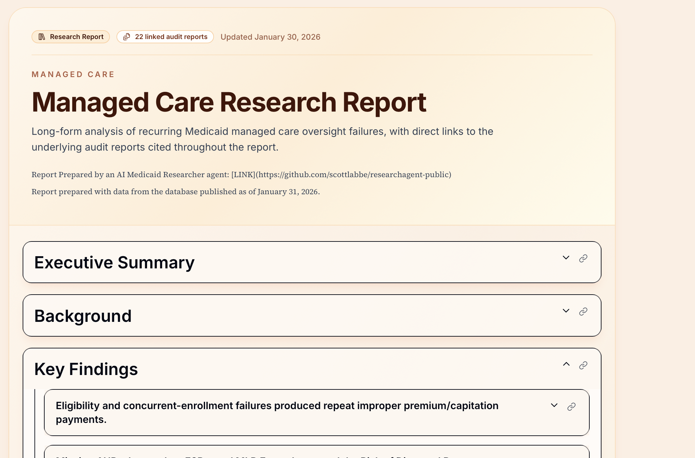
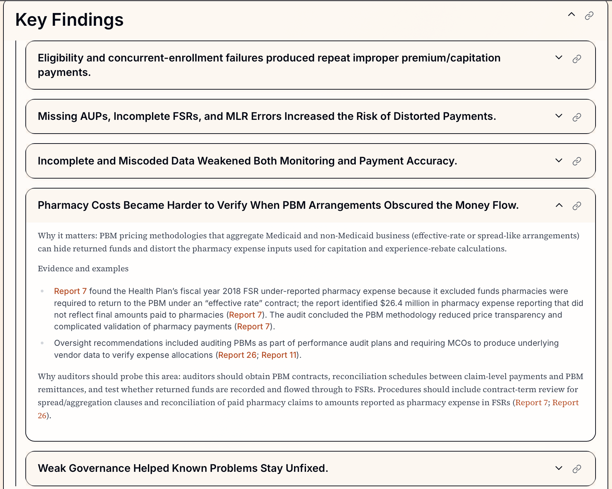
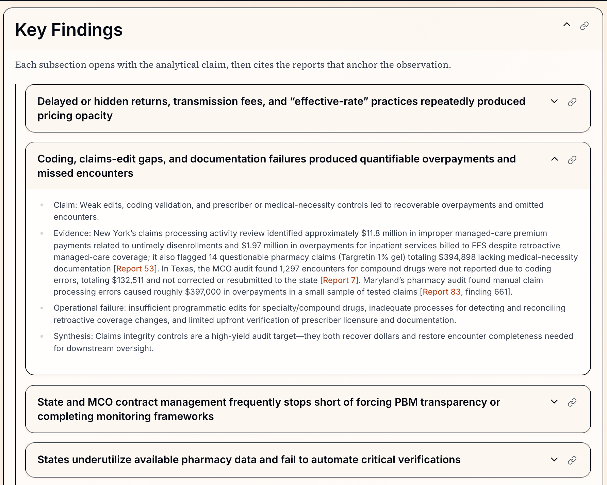
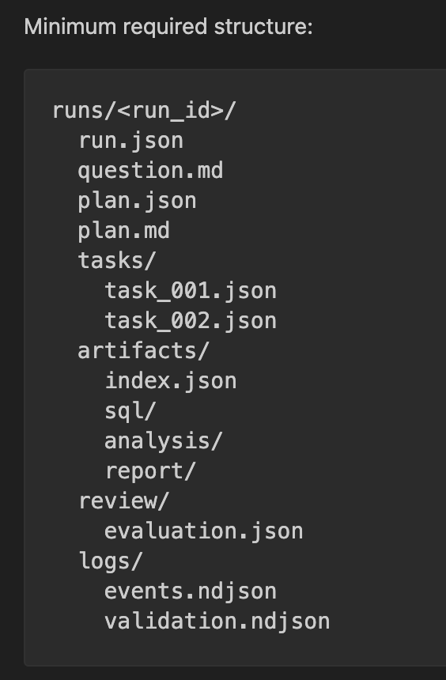
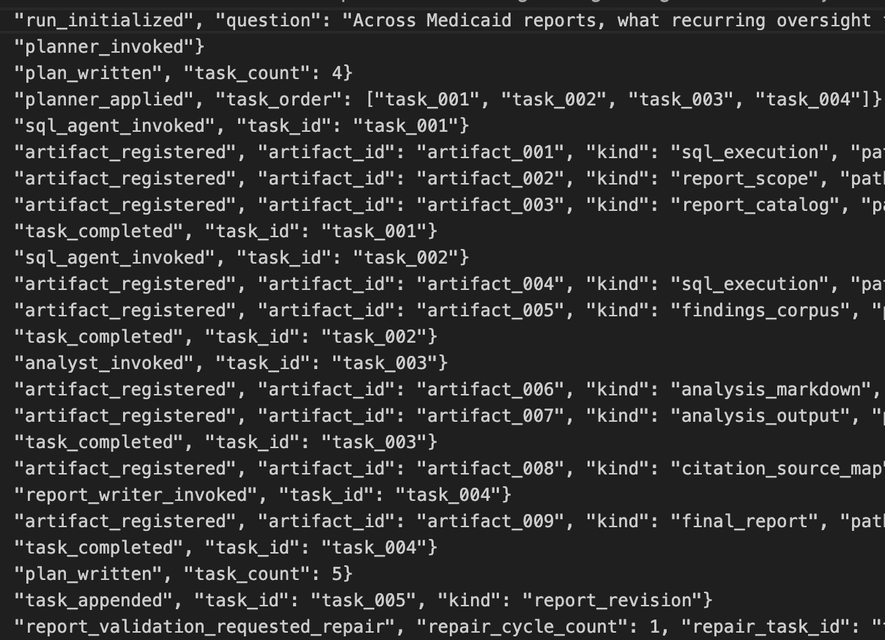

# Building an AI Research Agent for Medicaid Audit Reports

I built an AI research agent to automate the process of researching and analyzing patterns across a large set of Medicaid audit reports I have compiled at medicaidintelligence.com. 

This was actually a much harder problem than building the initial AI summary pipeline and database. It was harder because research is full of open-ended questions and problems. A research process includes taking a broad topic, narrowing the right set of reports, pulling relevant evidence, spotting recurring themes, and turning that research into a useful written report.

That kind of work is difficult to do well with a simple chatbot prompt. It requires planning, structured retrieval, focused analysis, and some way to verify that the final output is actually supported by the evidence.

To explore that problem, I built a workflow-based agent that can break a research question into steps, query a report database, analyze the results, draft a report, and check whether the final claims are grounded in the underlying evidence.  



## What I mean by an AI agent

For this project, I think of an AI agent as a system built around a language model that can do more than generate text. It can plan, use tools, produce supporting work or input for additional steps, and move through a structured process to complete a goal.

In this case, the goal was to carry out a research workflow and produce an evidence-backed report just from data included in the audit report database.

After building the AI summary pipeline I had a database of keywords extracted from more than 100 Medicaid audit reports. That gave me a foundation to experiment with, I could use LLMs to research those keyword topics and surface what kinds of issues keep showing up.

I worked with OpenAI’s Codex model for the last few weeks as I explored and tested various concepts and agent setups. I finally have a working prototype that I’m pretty happy with.

Here’s the links to check out the reports: 
- [Pharmacy Benefit Managers](https://www.medicaidintelligence.com/research/pharmacy-benefit-managers)
- [Managed Care](https://www.medicaidintelligence.com/research/managed-care)

Here’s some of the code for the agent: [GitHub Repo](https://github.com/scottlabbe/researchagent-public)

The public repository preserves the runner, prompts, contracts, and tests, but removes the live database adapter, sensitive SQL examples, and private corpus details:

## How the workflow is structured

I found pretty quickly that this worked better as a sequence of narrow roles than as one general-purpose agent trying to do everything at once.

Rather than asking one model to interpret the question, search the data, write SQL, analyze results, write a polished report, and verify its own claims all in one pass, I split the work into a handful of smaller, specialized steps.

The agent is actually made up of five subagents with very specific roles in the research process. Here’s how it works at a high level:

1. The user asks a question about information in the database.
2. **Research Planner** — creates tasks for other subagents to complete.
3. **SQL Agent** — writes and executes SQL queries to build a report corpus related to the topic.
4. **Analyst** — summarizes the research, groups themes, and makes observations.
5. **Report Writer** —  turns that analysis into a narrative report with canonical citations.
6. **Evaluator** — reviews the final report, verifies accuracy, citations, and can trigger a repair cycle.

Here are examples of the key findings identified in each report, each headline is a collapsible section that reveals the details and research along with links to the specific audit reports referenced in the report. 

### Managed Care



### Pharmacy Benefit Managers



## Lessons from building the agent

A few things stood out as I iterated on this system. Some of these are specific to this project, but most of them apply to agent design more broadly.

### Break down the problem into manageable, intuitive pieces

The agent consists of five subagents with very specific roles and objectives. This follows the way I broke down the problem, and it closely mirrors the steps I would go through if I were researching and creating a report myself.

A single general-purpose agent sounds simpler, but in practice it creates a few problems. The context gets crowded, the task becomes less defined, and it becomes harder to understand why the model produced a weak answer.

Breaking the workflow into smaller roles made the system easier to guide and easier to review. Each step only needs the context that matters for its specific job. The planning step does not need the full reporting prompt. The SQL step does not need to worry about writing polished prose. The evaluator does not need to re-run the whole workflow.

That separation made the outputs more reliable and made failures much easier to inspect.

### A filesystem-backed workflow made the system auditable and easier to manage 

One of the most useful design choices was making the filesystem the system of record, grounding it in simple files and folders. Instead of hiding everything inside one long conversation, the system writes out its intermediate work: the plan, the research tasks, the query outputs, the analysis notes, the report draft, and the evaluation results. Each run leaves behind a record of how the answer was produced.

That made the workflow much easier to review and trust. If anything seems suspect in the final report, the reference can be traced back to the evidence bundle generated by the workflow, the analysis document from the previous step, and the SQL query results obtained from the database.

This also helped with context management. Each step receives only the files it needs, instead of dragging along the entire history of the workflow. In practice, that made the system both cleaner and more reliable.

Each agent run produces a file structure:



### Models can do useful SQL work when the lane is narrow

I expected SQL generation to be one of the hardest parts of the project, and early on it was. The model improved a lot once I stopped treating SQL generation as an open-ended coding task and started giving it a more defined environment.

The biggest improvements came from providing the data schema, showing examples of the kinds of queries I actually wanted, and keeping the SQL agent focused on a narrow objective. I narrowed the lane for the model into a problem like “solve this kind of retrieval problem within known boundaries.”

That was a good reminder that agent design is often about reducing ambiguity. The model did better when the task was constrained, the available tools were clear, and success looked concrete.

### Building the foundation of research was the hardest problem to solve

The actual hardest problem to solve was helping the agent to define which reports belong in scope for the report. This is so important because if the body of research is too narrow, the analysis is incomplete. If it is too broad, the results become noisy and less useful. Either way, the evaluator subagent can't save a report built on an inadequate foundation.

The model has to identify the right body of reports to study before it can analyze themes or write a referenced report. That defined corpus of reports then carries through the entire workflow: 
- it defines which reports from the database are in scope for the report.
- it determines which findings and recommendations are retrieved.
- it gives the analyst a bounded evidence base to interpret.
- it sets the outer limits on what the final report can responsibly claim. 

The SQL examples and references I provided to the model were focused on defining the foundation of reports to analyze. Whether a model is doing the research or a human is doing the research, the steps will look very similar.

### Examples from workflow steps

To give a sense of how the pieces fit together, here are a few tasks the planner agent created for the other agents to perform. Notice how each task is scoped to a specific task for the subagent to complete. 

```json
{
  "task_id": "task_001",
  "kind": "corpus_scope",
  "role": "sql_agent",
  "title": "Identify PBM/pharmacy-related active reports",
  "description": "Return a report-grain result set listing active, non-hidden audit reports that are about PBMs or pharmacy issues (using report keywords)."
}

{
  "task_id": "task_002",
  "kind": "evidence_retrieval",
  "role": "sql_agent",
  "title": "Retrieve findings and linked recommendations for PBM/pharmacy reports",
  "description": "For the reports returned by task_001, return one row per finding including recommendation context and report metadata."
}

{
  "task_id": "task_004",
  "kind": "report",
  "role": "report_writer",
  "title": "Consultant-style report: recurring PBM oversight findings and audit process targets",
  "description": "Produce a consultant-style narrative report answering the user's question, grounded to the analysis output and evidence, with prioritized audit processes and concrete audit tests."
}
```
To give you a sense of the workflow the agent followed, here's the log of events that shows the exact workflow steps that the agent went through. As the agent worked through each task and created its own output for the next steps, it saved them as "artifacts" within the file system. 




### Models can improve their output with feedback

To take advantage of the model's ability to improve if given the right kind of feedback, the evaluator is a layer of the process that has the ability to spot issues and generate a repair cycle. 

The evaluator checks five specific dimensions defined in its prompt:

- Question coverage — does the report actually answer what was asked?
- Evidence grounding — are claims anchored in a body of evidence, or is the report stretching a single example into a broad generalization?
- Narrative quality — is it coherent and synthesized, not just a listing of database entries?
- Actionability — are recommendations concrete enough to guide real, useful follow-up?
- Residual risk — would you trust the report as-is or what is it missing?

The evaluator can "fail" the report completion process and generate a report_revision task to tighten citations, grounding, or writing without reopening the whole workflow.

Here's an example from an agent run where the evaluator determined the report citations need to be fixed: 

```json
{
  "task_id": "task_005",
  "kind": "report_revision",
  "role": "report_writer",
  "title": "Revise the report",
  "description": "Tighten the report using evaluator feedback without reopening retrieval or analysis.",
  "instructions": "Revise the report to resolve report validation issues using the existing evidence base.\n\nIssues:\n- Sources section is missing canonical [Report N] entries.\n- Sources Referenced is missing body-cited report ids: 6, 7, 53, 65, 83\n\nRequested follow-ups:\n- Address advisory report-validation warnings where possible.\n- Keep canonical [Report N] citations consistent between body and sources.",
}
```

## Closing thoughts

The clearest lesson I learned from this process was that to build a useful agent workflow to automate a research process, it really was about building a focused workflow with structure, constraints, and a clear trail of evidence. 

With the right kind of tools and context, it could move through a research process in a way that was reviewable and easier to trust and easier to improve. It really makes me wonder in what ways knowledge bases for organizations will be put to use in the future. 