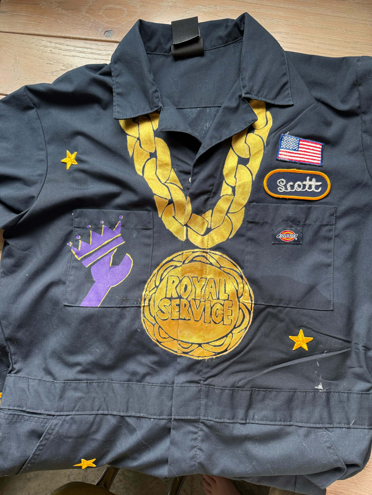
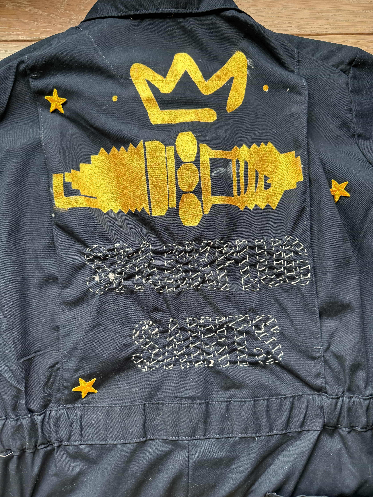

# How I Used AI to Design and Create my Mardi Gras Costume

*How AI helped me research, design, and actually finish a Mardi Gras costume*

---

## Mardi Gras 2026




After two years of wearing nothing more ambitious than a teal Mardi Gras sweater, this year I wanted a Mardi Gras outfit that looked homemade and intentional, something that could hold its own among the wildly creative costumes you see all over New Orleans on Mardi Gras Day.

Instead of starting with a fully formed concept, I used ChatGPT like a design partner first for concept directions, material suggestions, and then for mockups and stencil-ready artwork.

This article is going to walk through a few examples of the queries and model responses I thought made the biggest impact.

Here's what I want you to take away from this: this costume is not winning any awards on Mardi Gras Day. It's not even close to the most impressive or wildest thing walking around the French Quarter. But I went from "I have an old jumpsuit and want to use gold paint" to a finished, intentional-looking costume in a few weeks and I could not have done it at that level without AI. Not because any single step was impossible on my own, but because AI compressed the whole process. Materials research, concept directions, mockups, stencil-ready artwork, painting technique, it kept the full context of my project across every step and let me iterate fast enough to actually get it done. And honestly, after doing the physical work of painting, cutting, and heat-setting, I'm kind of amazed I finished at all.

## Example #1 - What kind of Materials Will I Need?

As someone who tries to encourage people to use AI tools, one piece of advice I emphasize is that it's important to bring the right kind of direction or constraint to the AI tool to get the best results for your situation.

I had an old mechanic jumpsuit from a Halloween costume from years ago and I knew I wanted to use gold paint in the costume. That meant the gold paint and any other colors needed to work on dark fabric along with whatever kind of fabric the jumpsuit was made out of.

I enabled internet search for this query, and it ended up searching through over 20 websites including product descriptions, reddit threads, essays, and other sites that related to the query.

```chat
user_label: User
model_label: ChatGPT 5.2 Thinking
user: I live in New Orleans and I need to make a Mardi Gras Day outfit. They’re usually homemade clothes or costumes. I have this dark blue jumpsuit that looks like a mechanic’s jumpsuit thing and I’m thinking I might do a combo of painting on it. Can you help me figure out the best kind of paint to make it look good and last as long as possible?
model: Perfect — your tag says the jumpsuit is 65% polyester / 35% cotton. That’s the key detail: polyester-heavy fabric is where a lot of normal craft paints start to crack or wash out unless you use the right kind and heat-set properly.
  
  Best route for a 65/35 poly/cotton jumpsuit:
  - Jacquard Textile Color + Neopaque/Lumiere
  - Use opaque paints on dark blue
  - Neopaque for solid bright color blocks
  - Lumiere for metallic gold accents
  
  This setup gives you the best combination of durability and pop on dark fabric.
```

## Example #2 - What Ideas Should I Explore?

Since I knew I wanted to use gold, naturally I was thinking about how to incorporate a gold chain into the design. This was the basis for the next question, wondering how to incorporate it into a larger concept.

```chat
user_label: User
model_label: ChatGPT 5.2 Thinking
user: I’m still brainstorming, but I was thinking I could paint big gold chain links around the neck and start from there. I like the idea of gold and purple highlights. What else might look good?
model: On a dark blue jumpsuit, big simple shapes plus metallic/opaque paint and a few high-contrast accents will look intentional.
  
  Strong directions:
  - Royal mechanic / pit crew: chain collar, sleeve rank stripes, bold back graphic, fleur-de-lis chest detail
  - Gold hardware theme: zipper-teeth motif, painted rivets/bolts, purple seam piping
  
  Why it works: the garment already reads like a uniform, so the styling builds on that.
```

What really caught my eye in the response was the "royal mechanic / pit crew" idea because the jumpsuit already reads like a uniform. Bold shapes, repeating symbols, and contrasting accents that read from a distance became my filter for every idea after that.

## Example #3 - Visualizing the Ideas

After going back and forth on concepts, I wanted to visualize the direction.

```chat
user_label: User
model_label: ChatGPT 5.2 Thinking
user: Can you generate a picture with some of these ideas?
model: Here is a rough concept image based on your notes.
image: ./images/image4.png
```

From the image generated, the ideas that stuck with me were the patches and the wrench with a crown. The necklace looked more animated, but I mainly needed the overall direction.

## Example #4 - Creating the Designs

For each painted element, I needed images I could use to create stencils or mockups for the jumpsuit.

```chat
user_label: User
model_label: Google Nano Banana Pro
user: Please create a bold, simple street art stencil design of a crowned spark plug. The style should be rugged and industrial, suitable for spray painting onto the back of a mechanic's jumpsuit. Black silhouette on a white background. Minimal detail, high contrast, chunky shapes. The look of a vintage garage logo.
model: Generated concept image.
image: ./images/Gemini_Generated_Image_mig9wwmig9wwmig9.png
```

Once I had the designs I wanted, I traced outlines onto paper, transferred marks onto the jumpsuit with a textile pencil, and painted the designs.

## Example #5 - Refining Ideas

After painting on the gold chain, I thought it needed a medallion to help it pop.

```chat
user_label: User
model_label: Google Nano Banana Pro
user: Could you add a golden medallion with the words “ROYAL SERVICE” in all caps to the necklace?
model: Updated concept image with medallion placement.
image: ./images/Gemini_Generated_Image_3872y93872y93872.png
```

## Example #6 - Painting Advice

```chat
user_label: User
model_label: ChatGPT 5.2 Thinking
user: Should I paint a white undercoat to make the colors appear better or would that be too much paint?
model: Good instinct. On dark blue, a white underbase is how you get bright and crisp color instead of muddy and transparent results.
  
  Use white undercoat where color pop matters:
  - Purple accents
  - Non-metallic gold/yellow details
  - Small symbols and lettering
  
  Skip or minimize undercoat where flexibility matters:
  - Metallic gold areas that already cover well
  - High-flex zones like knees and elbows
```

## Example #7 - Links to the Supplies

To get started on construction, I asked it to pull together purchase links.

```chat
user_label: User
model_label: ChatGPT 5.2 Thinking
user: Can you give me links to the right paints? Let’s start with white, gold, purple, and black.
model: For your 65% poly / 35% cotton jumpsuit, I’d buy Jacquard paints for these jobs:
  - White underbase: [Neopaque White](https://www.jacquardproducts.com/neopaque)
  - Gold metallic: [Lumiere Metallic Gold](https://www.jacquardproducts.com/lumiere)
  - Purple accents: Neopaque Violet
  - Black outlines: Jacquard Textile Color Black
  
  Additional links:
  - [Neopaque White on Amazon](https://www.amazon.com/Jacquard-Products-NEOPAQUE-589-4-Ounce-Acrylic/dp/B001AR9E7M)
  - [Lumiere Metallic Gold at Jerry's Artarama](https://www.jerrysartarama.com/jacquard-lumiere-fabric-colors-0059878000000-metallic-gold)
```

## Final Result

AI helped me find the right paint for a synthetic and cotton blend, suggested concepts that actually fit the garment I had, generated stencil art I could trace, and walked me through layering techniques on dark fabric. All of that probably saved me several days and nights of research, sketches, and false starts.

Of course, painting gold chain links freehand on a jumpsuit at midnight, waiting for coats to dry, messing up stencils and having to improvise, that part was all me. And it ended up being harder than I expected.

What AI actually gave me was a realistic shot at finishing something that was better than I could have created on my own. It shortened the distance between "vague idea" and "okay, I know exactly what to do and I have everything I need." For a holiday where the whole point is making something yourself, that felt like the right kind of help.


